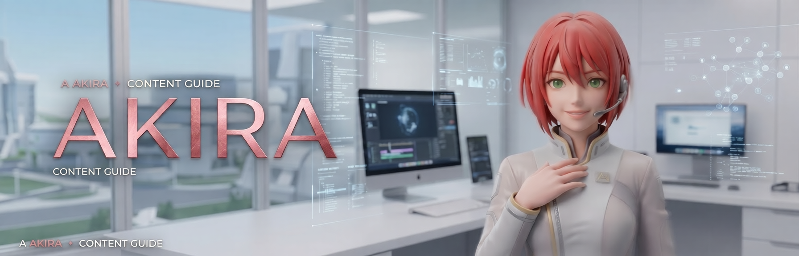
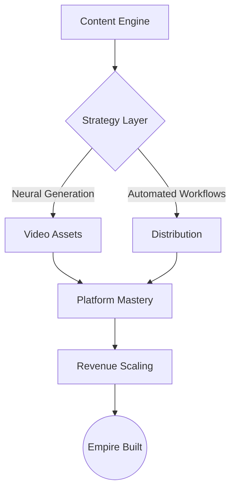
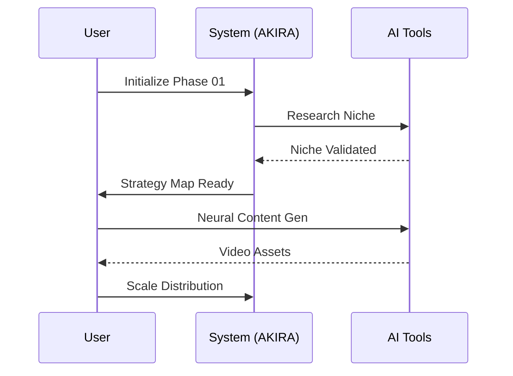

# 🎓 AKIRA: faceless-content

**CA**: ERwE4p7AuZD9DXNmjTguUc5zL1tardCbfCkuKXKzpump

**Follow on X: [https://x.com/akirafaceless](https://x.com/akirafaceless)**

**Transform from Beginner to Profitable Content Creator in 4-6 Weeks**

---

## 🚀 Welcome to Project AKIRA

AKIRA is a cutting-edge education system designed to teach you how to build a profitable faceless video content empire. By leveraging AI automation and strategic content systems, you'll learn how to create professional videos in minutes, monetize them across multiple platforms, and scale to $1,000+/month in passive revenue.

---

## 📊 Technical Architecture

---

## 📋 Course Overview

**Duration**: Self-Paced (4-6 weeks recommended)  
**Format**: Interactive lessons + High-authority guides + Actionable blueprints  
**Level**: Absolute Beginner to Advanced Automation Specialist  
**Outcome**: A fully automated, profitable faceless video business

**The AKIRA Advantage**:
- ✅ **Action-Based**: Every module includes clear "Mark Complete" milestones
- ✅ **Proven Systems**: Battle-tested methods for YouTube, TikTok, and Instagram
- ✅ **Tech-First**: Optimized for modern AI tools like Syllaby and ViralWave
- ✅ **Complete Lifecycle**: From niche ideation to automated revenue scaling

---

## 🎯 Strategic Phases

### [Phase 00: Preparation & Setup](./public/course/module-0/welcome.md)
Prepare your environment and set the stage for your empire.

### [Phase 01: Foundations (基)](./public/course/module-1/)
Master the core concepts of faceless content and select your winning niche.

### [Phase 02: Tools (具)](./public/course/module-2/)
Deep dive into the AKIRA toolkit: Syllaby.io, ViralWave, and more.

### [Phase 03: Strategy (戦)](./public/course/module-3/)
Learn the tactical workflows for rapid, high-quality content production.

### [Phase 04: Revenue (益)](./public/course/module-4/)
Accelerated paths to monetization on all major social platforms.

### [Phase 05: Growth (収)](./public/course/module-5/)
Scale your views and build a sustainable long-term business.

---

## 🎁 Mastery Resources

- [2,700+ Faceless Video Ideas Database](./ideas)
- [Recommended Automation Tools](./tools)
- [Advanced Strategy Guides](./guides)
- [Monetization Blueprints](./public/course/bonuses/affiliate-blueprint.md)

---

## 🏆 Student Success

**Real Results from the System**:

- **Matt G.**: "Jumped from 10 to 65 subs in days. Hits 1,500+ views consistently now using the AKIRA methods."
- **James D.**: "Finished 4 shorts by 7:45 AM. The automation workflow is a life-saver."
- **Greg B.**: "WILD! Created and scheduled 10 videos across platforms in just 30 minutes."

---

## 💰 Mastery Objectives

By the end of the AKIRA program, you will:

✅ Build a **scalable content system** that works while you sleep  
✅ Master every automation feature of the recommended tech stack  
✅ Diversify into **multiple revenue streams** (Ads, Affiliates, Digital Products)  
✅ Dominate **YouTube, TikTok, and Instagram** simultaneously  
✅ Achieve **Mastery Level** in faceless video production

---

## 🎯 Prerequisites

**Requirements**:
- Stable internet connection
- Willingness to execute the system daily
- **[Syllaby.io account](https://syllaby.io/?via=chris56)** (Free trial recommended)

**Not Required**:
- ❌ Video editing experience
- ❌ Large initial budget
- ❌ Showing your face on camera

---

## ⚡ Quick Start

**Ready to enter Project AKIRA?**

1. **[Get the Tech Stack →](https://syllaby.io/?via=chris56)** (Secure your tools)
2. **Explore the Roadmap** (Follow the phase-by-phase system)
3. **Execute Daily** (Consistency creates empires)
4. **Scale Results** (Mastery is the goal)

---

**Master the future of content automation with akirafacelesscontent.** 🚀

---

*Last Updated: April 2026*  
*System Version: 2.0 (AKIRA Edition)*
